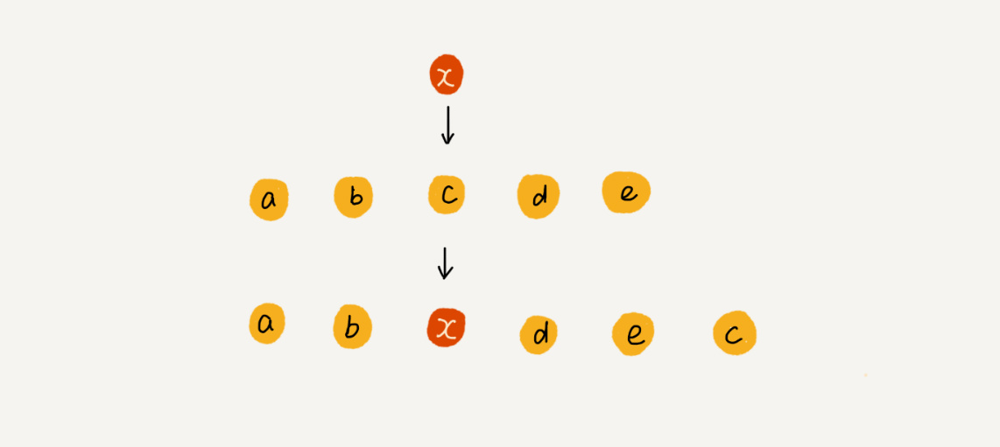

# 入门篇
## 如何抓住重点
1.学会复杂度分析。

2.学习每种数据结构算法的来历，自身特点，适合解决的问题，实际运用的场景。

3.坚持练习，自己实现课程内容和思考题，然后适度刷题(速度：每周三课)。

4.知识需要沉淀，不行就多刷几遍。

## 复杂度分析（上）：如何分析、统计算法的执行效率和资源消耗？
1.时间空间复杂度，大O表示法。

2.大O表示法：描述的是一段代码随着问题数据规模增长，它的执行时间/占用内存增长的趋势，常见的有线性O(n),常量O(1),对数O(logn)，指数O(2^n),线性对数O(nlogn)，阶乘O(n!)。

3.大O时间复杂度实际上并不具体表示代码真正的执行时间，而是表示代码执行时间随数据规模增长的变化趋势，所以，也叫作渐进时间复杂度（asymptotic time complexity），简称时间复杂度。

4.空间复杂度类似。


## 复杂度分析（下）：浅析最好、最坏、平均、均摊时间复杂度

1.最好情况时间复杂度就是，在最理想的情况下，执行这段代码的时间复杂度。

2.最坏情况时间复杂度就是，在最糟糕的情况下，执行这段代码的时间复杂度。

3.平均时间复杂度要考虑每种情况出现的概率，算加权平均值。

4.均摊时间复杂度，针对特殊的有规律的情况，无需引入概率方法算加权平均，重点是摊还分析方法。

5.对一个数据结构进行一组连续操作中，大部分情况下时间复杂度都很低，只有个别情况下时间复杂度比较高，而且这些操作之间存在前后连贯的时序关系，这个时候，我们就可以将这一组操作放在一块儿分析，看是否能将较高时间复杂度那次操作的耗时，平摊到其他那些时间复杂度比较低的操作上。而且，在能够应用均摊时间复杂度分析的场合，一般均摊时间复杂度就等于最好情况时间复杂度。

# 基础篇

## 数组：为什么很多编程语言中数组都从0开始编号？
1、数组是线性表的一种，还有栈，队列，链表。

2、非线性表有：树，图

3.数组支持随机访问，且复杂度O(1)

4.插入和删除操作会导致数据移动(为了保证数据连续)，但在特定场景中可以一定程度避免这种移动。比如插入时：如果数组中存储的数据并没有任何规律，数组只是被当作一个存储数据的集合。在这种情况下，如果要将某个数据插入到第 k 个位置，为了避免大规模的数据搬移，我们还有一个简单的办法就是，直接将第 k 位的数据搬移到数组元素的最后，把新的元素直接放入第 k 个位置。



5.再看删除操作：在某些特殊场景下，我们并不一定非得追求数组中数据的连续性。如果我们将多次删除操作集中在一起执行，删除的效率是不是会提高很多呢？ JVM的mark sweep 垃圾回收算法中也有类似思想，先标记，再一次性移除。

6.高级语言比如java中的容器和数组如何选择：绝大多数情况应该选择容器，如果数据大小固定且已知，且操作简单，则也可以用数组。

7.最后为啥数组index从0开始，index定义的是offset即偏移，而数组名一般指定的数组所占空间的起始地址。当然历史原因也可能的。毕竟从汇编角度看地一个元素的offset就是0。

## 链表（上）：如何实现LRU缓存淘汰算法?
加粗部分代码实现一下。

1.**约瑟夫问题**：N个人围成一圈，从约定编号为K的人开始报数，第M个将被杀掉，依次类推，最后剩下一个，其余人都将被杀掉。

2.双链表相对单链表优势，知道要删除的节点时可以直接删除，无需遍历找到prev node。某个指定节点前插入操作类似。

3.链表对cache的预读机制不友好。

4.**如何基于单链表实现lru缓存策略**：对于已经缓存的数据，需要先从当位置删除，然后将数据插入到头部，如果缓存已满还要删除尾部的数据。寻找已经存在的数据需要O(n)，这受制于单链表的特性，可以用hashcode降低为O(1)。

5.**如何基于数组实现lru策略**:和单链表类似，只不过删除插入操作会比较耗时，类似android ams中的process lru，为了避免频繁移动，可以先做特殊标记，插入时如果满了，则一次性移动。

6.**判断单链表回文**：寻找中间节点，反转其中一个，然后二者对比。

## 链表（下）：如何轻松写出正确的链表代码？

1.单链表代码：可以利用哨兵节点简化特殊情况的处理。

2.注意边界处理：链表为空，链表包含一个节点，链表包含2个节点，链表在处理头节点和尾节点时是否OK。

3.**习题**：单链表反转、链表中环的检测（快慢指针）、两个有序的链表合并、删除链表倒数第n个结点（快慢指针）、求链表的中间结点（快慢指针），约瑟夫问题。

## stack：如何实现浏览器的前进后退功能

1.自定义stack，支持动态扩容，带有这种功能的stack的入栈操作的均摊时间复杂度就为 O(1)


2.stack在函数调用过程的应用

3.**在表达式求值中的应用**

从左向右遍历表达式，当遇到数字，我们就直接压入操作数栈；当遇到运算符，就与运算符栈的栈顶元素进行比较。如果比运算符栈顶元素的优先级高，就将当前运算符压入栈；如果比运算符栈顶元素的优先级低或者相同，从运算符栈中取栈顶运算符，从操作数栈的栈顶取 2 个操作数，然后进行计算，再把计算完的结果压入操作数栈，继续比较。


4.**括号匹配中的应用**

用栈来保存未匹配的左括号，从左到右依次扫描字符串。当扫描到左括号时，则将其压入栈中；当扫描到右括号时，从栈顶取出一个左括号。如果能够匹配，比如“(”跟“)”匹配，“[”跟“]”匹配，“{”跟“}”匹配，则继续扫描剩下的字符串。如果扫描的过程中，遇到不能配对的右括号，或者栈中没有数据，则说明为非法格式。当所有的括号都扫描完成之后，如果栈为空，则说明字符串为合法格式；否则，说明有未匹配的左括号，为非法格式。

5.使用两个stack完成浏览器的前进 后退 功能

## 队列

1.循环队列、阻塞队列、并发队列

2.**阻塞队列**其实就是在队列基础上增加了阻塞操作。简单来说，就是在队列为空的时候，从队头取数据会被阻塞。因为此时还没有数据可取，直到队列中有了数据才能返回；如果队列已经满了，那么插入数据的操作就会被阻塞，直到队列中有空闲位置后再插入数据，然后再返回

3.**线程安全的队列**我们叫作并发队列。最简单直接的实现方式是直接在 enqueue()、dequeue() 方法上加锁，但是锁粒度大并发度会比较低，同一时刻仅允许一个存或者取操作。实际上，基于数组的循环队列，利用 CAS 原子操作，可以实现非常高效的并发队列。

4.**对于大部分资源有限的场景，当没有空闲资源时，基本上都可以通过“队列”这种数据结构来实现请求排队**

## 递归

1.递归需要满足的条件：可以分解为几个子问题，子问题除了数据规模不同，思路完全相同，存在终止条件。

2.递归代码要警惕堆栈溢出：比如限制递归深度

3.警惕重复计算, 所谓剪枝？为了避免重复计算，我们可以通过一个数据结构（比如散列表）来保存已经求解过的 f(k)。当递归调用到 f(k) 时，先看下是否已经求解过了。如果是，则直接从散列表中取值返回，不需要重复计算，这样就能避免刚讲的问题了。

4.递归需要堆栈保存现场，所以很多时候空间复杂度不是O(1)

5.**例题**：假如这里有 n 个台阶，每次你可以跨 1 个台阶或者 2 个台阶，请问走这 n 个台阶有多少种走法？如果有 7 个台阶，你可以 2，2，2，1 这样子上去，也可以 1，2，1，1，2 这样子上去，总之走法有很多，那如何用编程求得总共有多少种走法呢？

```java
int f(int n) { 
    if (n == 1) return 1; 
    if (n == 2) return 2;
    return f(n-1) + f(n-2);
}
```
几乎所有递归都可以修改为非递归形式
```java
int f(n) {
    if (n == 1) return 1;
    if (n == 2) return 2;
    int pre = 2;
    int prepre = 1;
    int n = 0;
    for (int i = 3; i <= n; i++) {
        n = pre + prepre;
        prepre = pre;
        pre = n;
    }
    return n;
}
```

6.如何找到最终推荐人
```java
long findRootReferrerId(long actorId) {
  Long referrerId = select referrer_id from [table] where actor_id = actorId;
  if (referrerId == null) return actorId;
  return findRootReferrerId(referrerId);
}
```

## 排序（上）：为什么插入排序比冒泡排序更受欢迎？

1.冒泡排序、插入排序、选择排序、归并排序、快速排序、计数排序、基数排序、桶排序


2.插入排序对比冒泡来说，交换操作更为简单，也就是更快。

3.衡量排序算法的时间效率：最好最坏平均时间复杂度，意味着排序算法在面对不同规律的数据时的表现是否稳定和一致；时间复杂度的系数，常数，低阶对于小规模数据来说也很重要；基于比较和交换的排序，应该要考虑比较和交换的次数。

4.排序算法的稳定性:实际实践中往往是根据数据的某个字段作为key排序，那么排序后key大小相同的数据的前后位置关系是否发生变化，再某些实际场景中需要考虑。

## 排序(下)：如何用快排思想在O(n)内查找第K大元素？

1.归并排序和快速排序都用到了分治思想。分治思想一般都用递归来实现。

2.归并排序空间消耗在merge的部分，使得归并排序不是原地排序。

3.快速排序分区的时候，利用插入排序的思想， 分为已处理区间和未处理区间。

4.利用快排思想分治寻找第K大的元素的时间复杂度是O(n): 2n-1

## 线性排序：如何根据年龄给100万用户数据排序？

1.时间复杂度为O(n), 通常对数据有特殊要求。方便使用桶排序，计数排序，基数排序。

2.桶排序：对数据分到几个有序的桶里面，每个桶里面的数据单独排序，比如快速排序，那么n个数据，分m个桶，每个桶的复杂度为O((n/m)log(n/m)),

整体的复杂度就是O(nlog(n/m))，当桶的个数m接近数据量n的时候， log(n/m) 是非常小的常量，这个时候整体复杂度接近O(n)

3.桶排序对数据有要求，数据需要很容易划分到m个桶中，另外数据应该均匀的分布在各个桶中，否则就会退化为正常的排序。桶排序比较适合外部排序，即

数据量大，无法一次性读入内存。分桶的时候如果出现某个桶中的数据太多，则可以进一步对桶进行细分。

4.计数排序：是桶排序的特殊情况，当数据范围不大的时候，比如范围0-k，则可以分成k个桶，这样每个桶中的数据就不用排序了，相同。比如考试分数排序就适合计数排序。

5.radixSort： 需要数据可以分为高低位，位之间有递进关系，高位相同才比较低位，而且每一位的数据范围不能太大，因为我们要依赖桶排序或者计数排序。对每个位排序时要

用稳定排序算法。对于不等长的数据可以采取补齐的方案。

## 排序优化：如何实现一个通用的、高性能的排序函数？

1.归并排序因为O(n)的空间复杂度，实际应用场景不多，虽然它的时间复杂度非常稳定。

2.小规模数据排序可以采用O(n^2)，通常为了兼顾任意规模的数据，我们都会选择O(logN)的方法。

3.对于快速排序如何优化它在最坏的情况下退化为O(n^2)的情况： 选择理想的区分点，比如三数取中，随机等。还要避免递归实现导致的栈溢出。

4.在小规模数据面前，O(n2) 时间复杂度的算法并不一定比 O(nlogn) 的算法执行时间长。

## 二分查找（上）：如何用最省内存的方式实现快速查找功能？

1.二分查找复杂度位logN， logN非常恐怖，比O(1)还高效。

2.二分查找的局限性：数据结构位线性表即数组，针对有序数据。用在插入删除不频繁的场景中，

3.数据量太小不划算，体现不出优势，数据量太大也不行，需要连续内存。

##  二分查找（下）：如何快速定位IP对应的省份地址？

1.IP地址问题，使用起始ip地址用二分查找？

2.对于存在重复数据的场景，二分查找存在集中变体：第一个值等于给定值的元素，最后一个值等于给定值的元素，第一个大于等于给定值的元素，最后一个小于等于给定值的元素.

3.对于IP地址问题：先按照区间的起始ip地址从小到大排序，然后问题转换为“最后一个小于等于指定ip的地址”，然后检查此区间是否存在指定ip。

4.二分查找相对于二叉查找树或者散列表，更适合于近似查找，比如上述几种变体，此时散列表或者二叉查找树不太适用。

## 散列表（上）：Word文档中的单词拼写检查功能是如何实现的？

1.散列表利用的是数组可以按照下标随机访问的特性，即散列表是从数组演化来的。问题的关键是从key到value的映射。这个从key计算而来的“下标”就是hash值，这个通过key计算hash的函数叫做散列函数。

2.散列函数应该具备的特点：结果为非负数，key相同时计算的hash应该一样，key不同时计算的hash不同（这一点比较难，总是会存在hash冲突）。

3.散列冲突的解决办法：开放地址法，连表法。

4.hash表的装载因子不能太大，否则冲突的概率肯定会加大。

5.word文档单词纠错：常用单词20W，假设平均10个字母，即需要20w * 10 个字节，为2M，可以使用hash表解决此问题。

### 6.10万条url访问日志，如何快速根据访问次数来给url排序。

即每条日志l仅仅是url而以，多次访问的url会有多条日志。

遍历日志，以字符串为key，（次数+字符串）为value，构建hash表，得到的就是一个数组，元素为复合数据（次数+字符串本身）

之后就可以根据次数范围大小，决定使用快排还是桶排序。


### 7.有两个字符串数组，每个数组大约有 10 万条字符串，如何快速找出两个数组中相同的字符串？

先对第一个数组中的字符串构建hash表，key为字符串，value为出字符串地址，然后再对第二个数组遍历，以字符串为key在hash表中查找，如果value地址不为null，则说明存在相同的字符串。

如果需要考虑冲突的解决，则可以使用连表法，依次比较链表中的字符串即可。

## 散列表（中）：如何打造一个工业级水平的散列表？

1.如何设计一个可以应对各种异常情况的工业级散列表，避免散列冲突的情况下性呢急剧下降。

2.如何设计散列函数：避免太复杂耗时，生成的hash尽可能的均匀分布避免冲突，即便冲突了每个槽里面的数据也会比较平均。

3.装载因子过大了怎么办：动态扩容和缩小，扩容后为了避免一次性拷贝大量数据，可以在后续的插入操作中顺带拷贝一个数据，同时查询的时候应该先去旧的hash表中查询，然后再去新的hash表中查询。

4.如何选择冲突解决办法：开放寻址法和链表法各自的优势劣势是什么。

5.开放寻址法：数据都存在数组中方便查询，对cache比较友好，序列化简单。但是删除元素比较麻烦需要特殊标记删除的元素,而且一旦冲突代价很高，因此适合数据量不大且装载因子不大的场景。

6.链表法：对大装载因子容忍度较高，最多就是链表变长，如果hash比较均匀，链表长度就比较有限。可以对链表改造为红黑树等结构，提高冲突后的查询速度。避免恶化为O(n).

## 散列表（下）：为什么散列表和链表经常会一起使用？

散列表虽然查询高效，但是无法按照某种顺序快速的遍历数据，如果想要遍历就要先按照某种顺序拷贝到数组中才行，但是hash表是动态的，频繁的插入删除，每次遍历都要拷贝到数组中，效率不行。

因此结合链表使用可以降低顺序遍历的复杂度。


1.基于链表实现lru缓存淘汰算法时，查询/删除的复杂度为O(n),因为要遍历链表，但是如果引入hash表，数据同时在一个hash表中，则可以在O(1)时间内查到数据。


2.通过hash查找到后，需要将查到的数据移动到拉链的尾部（方便删除）？

3.上面O(1)查询后，拉链尾部直接删除，lru双向链表同样可以在O(1)时间内删除。

## 二叉树基础（上）：什么样的二叉树适合用数组来存储？

树的高度：节点到叶子节点的最长路径（边数）

深度：根节点到此节点经过的边的个数

层：深度+1


1.满二叉树：除了叶子节点以外，其他所有节点都有2个子节点。

2.完全二叉树：叶子节点都在最后2层,最后一层的叶子节点都靠左排列，并且除了最后一层，其他层的节点个数都要达到最大。

3.完全二叉树非常适合使用数组表示，不会浪费空间。堆其实就是一种完全二叉树，最常用的存储方式就是数组。

4.二叉树的前序，中序，后序遍历：常用递归。

5.二叉树按照层遍历，适合使用队列遍历。

## 二叉树基础（下）：有了如此高效的散列表，为什么还需要二叉树？

1.二叉查找树最大的特点就是，支持动态数据集合的快速插入、删除、查找操作。但是hash表也支持这些操作，且复杂度O(1)。

2.解答开篇：hash表中的数据是无序的，如果要按顺序输出，则要先排序。但是对于二叉查找树只要中序遍历，O(logn)。hash表扩容耗时很多

遇到冲突时性能不稳定，工程中常用的平衡二叉查找树性能非常稳定O(logn)。hash表的构建更复杂需要考虑散列函数设计，冲突解决，扩容，缩容等，

而平衡二叉查找树只需要考虑平衡性问题，解决方案成熟稳定。

3.二叉查找树的查询，插入，删除操作的代码实现。

4.编码计算二叉树的高度。

## 堆和堆排序：为什么说堆排序没有快速排序快？

1.堆是一个完全二叉树，每个节点必须 大于等于（或小于等于）子树的每个节点，分别称为大顶堆和小顶堆。

2.数组非常适合用来存储堆。

3.堆化的过程是顺着节点所在路径比较交换的，所以堆化的时间复杂度跟树的高度成正比，也就是 O(logn)。插入数据和删除堆顶元素的主要逻辑就是堆化，所以，往堆中插入一个元素和删除堆顶元素的时间复杂度都是 O(logn)。

4.堆排序：原地建堆 和 排序, 不是稳定的排序算法

5.解答开篇：堆排序的数据访问方式没有快速排序友好。排序过程中的交换次数堆排序更多。

## 堆的应用：如何快速获取到Top 10最热门的搜索关键词？

1.堆这种数据结构几个非常重要的应用：优先级队列、求 Top K 和求中位数。

2.赫夫曼编码、图的最短路径、最小生成树算法 等 都依赖优先级队列

3.优先级队列应用：合并有序小文件，高性能定时器(堆顶始终是最先要执行的任务，避免轮训)

4.topk:针对静态数据可以创建一个大小为K的大顶堆即可，针对动态数据维护两个堆，大小为k的大顶堆，大小为n-k的小顶堆，

每次插入或者删除数据的时候 保持大顶堆的大小保持k不变。

5.解答开篇：首先hash表去重并记录关键字出现的次数，然后扫描hash表建大小为10的大顶堆即可。如果数据量太大超过内存限制，可以利用hash算法对

数据分片10片，依次按照前面的方法处理每片数据， 然后集合每片的top 10， 再处理一次

## 字符串匹配基础（上）：如何借助哈希算法实现高效字符串匹配？

1.BF法：朴素，主串长n，子串长m，复杂度O(n*m)

2.RK：理想时为O(n), hash冲突严重时退化为O(n*m)  

## Trie树：如何实现搜索引擎的搜索关键词提示功能？

1.公共前缀, 其中，根节点不包含任何信息。每个节点表示一个字符串中的字符，从根节点到红色节点的一条路径表示一个字符串（注意：红色节点并不都是叶子节点）。


2.Trie 树，也叫“字典树”。顾名思义，它是一个树形结构。它是一种专门处理字符串匹配的数据结构，用来解决在一组字符串集合中快速查找某个字符串的问题。

3.如何实现trie树：多叉树。构建 Trie 树的过程，需要扫描所有的字符串，时间复杂度是 O(n)（n 表示所有字符串的长度和）

4.缺点：即便一个节点只有一个节点，我们也要维护长度为26的数组。对此可以牺牲一些查询效率，将节点中的数组换成有序数组，跳表，散列表等结构

5.解答开篇：trie树非常适合搜索关键词提示功能.

6.trie 树最有优势的是查找前缀匹配的字符串，比如搜索引擎中的关键词提示功能这个场景，就比较适合用它来解决，也是 Trie 树比较经典的应用场景。

## 图的表示：如何存储微博、微信等社交网络中的好友关系？

1.顶点，边，度。有向图的入读和出度。带权度的边右不同权重。

2.图的存储方法：邻接矩阵，邻接表。

3.邻接矩阵：无向图的情况会浪费一半空间，稀疏图(顶点多，边少)浪费空间。

4.邻接表： 类似于链表法的hash表。将邻接表中的链表改为支持快速查找的动态数据结构。选择哪种动态数据结构呢？红黑树、跳表、有序动态数组还是散列表。


5.逆邻接表


6.数据规模太大无法全部存储在内存中的时候，可以使用hash分片

## 深度和广度优先搜索：如何找出社交网络中的三度好友关系？

1.bfs dfs
2.解答开篇：bfs适合解决
